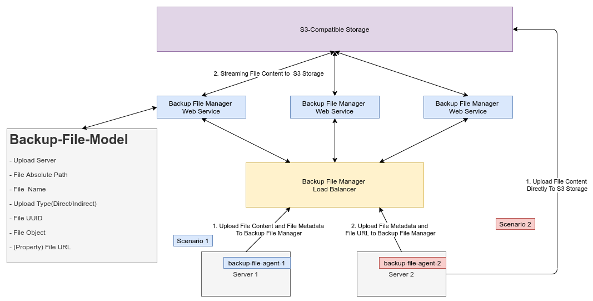

# Backup File Manager

A managing backup server files Web Service . Allow users to backup file from
multiple servers to a central storage, and manage backedup files easily via
web interface and HTTP API Interface.

## Architecture




## Screenshots


## Use HTTP API To Upload File From Client

```python
import requests

url = "http://127.0.0.1:8000/api/file-manager/backup-files/"

payload = {
    'upload_server': '3',
    'absolute_file_path': '/absolute-path-to-file/video-test-113.mp4',
    'filename': 'video-test-113.mp4'
}
files = [
  ('file', open('/absolute-path-to-file/video-test-113.mp4','rb'))
]
headers = {
  'Authorization': 'Token  USER_API_TOKEN',
  'Content-Type': 'application/json'
}

response = requests.request("POST", url, headers=headers, data = payload, files = files)

print(response.text.encode('utf8'))

```

Or

```bash
curl --location --request POST 'http://127.0.0.1:8000/api/file-manager/backup-files/' \
--header 'Authorization: Token  USER_API_TOKEN' \
--header 'Content-Type: application/json' \
--form 'upload_server=3' \
--form 'absolute_file_path=/absolute-path-to-file/video-test-113.mp4' \
--form 'filename=video-test-113.mp4' \
--form 'file=@/absolute-path-to-file/video-test-113.mp4'
```
